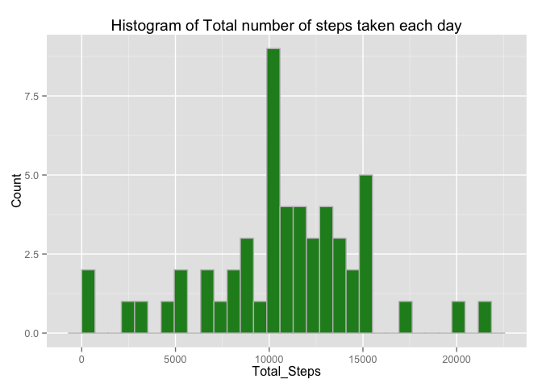
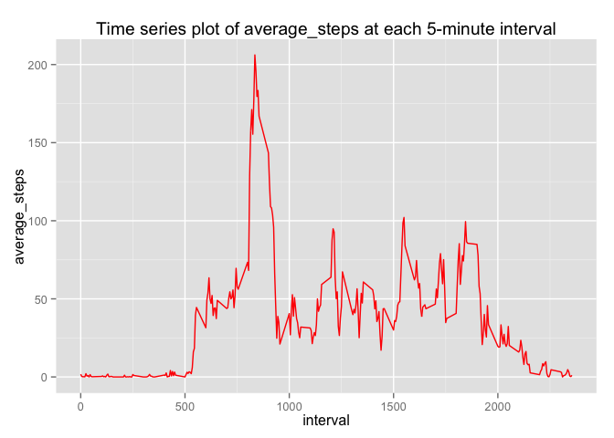
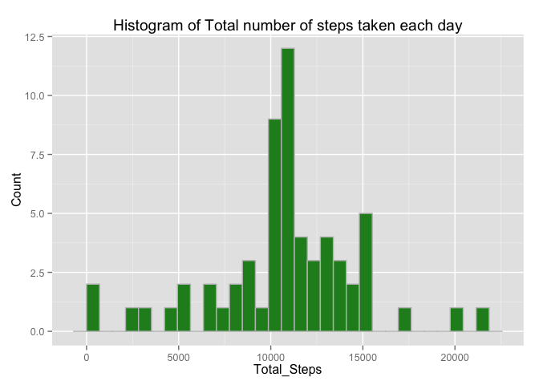
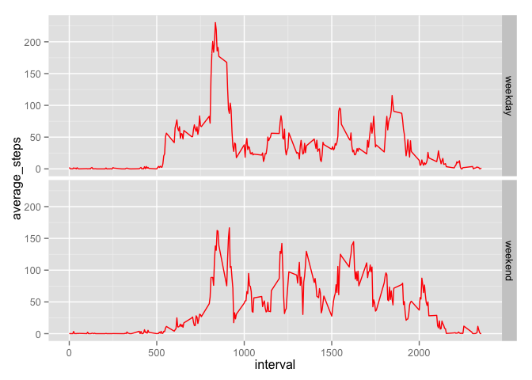

# Reproducible Research: Peer Assessment 1


## 1. Loading and preprocessing the data

```r
library(ggplot2)
```

```
## Warning: package 'ggplot2' was built under R version 3.1.3
```

```r
library(dplyr)
```

```
## Warning: package 'dplyr' was built under R version 3.1.2
```

```
## 
## Attaching package: 'dplyr'
## 
## The following object is masked from 'package:stats':
## 
##     filter
## 
## The following objects are masked from 'package:base':
## 
##     intersect, setdiff, setequal, union
```

```r
setwd('.')
getwd()
```

```
## [1] "/Users/gmedasani/Documents/courses/Coursera/DataScience-Track/ReproducibleResearch/Week2/project1/RepData_PeerAssessment1"
```

```r
activity_data <- read.csv("activity.csv")
summary(activity_data)
```

```
##      steps                date          interval     
##  Min.   :  0.00   2012-10-01:  288   Min.   :   0.0  
##  1st Qu.:  0.00   2012-10-02:  288   1st Qu.: 588.8  
##  Median :  0.00   2012-10-03:  288   Median :1177.5  
##  Mean   : 37.38   2012-10-04:  288   Mean   :1177.5  
##  3rd Qu.: 12.00   2012-10-05:  288   3rd Qu.:1766.2  
##  Max.   :806.00   2012-10-06:  288   Max.   :2355.0  
##  NA's   :2304     (Other)   :15840
```

```r
head(activity_data)
```

```
##   steps       date interval
## 1    NA 2012-10-01        0
## 2    NA 2012-10-01        5
## 3    NA 2012-10-01       10
## 4    NA 2012-10-01       15
## 5    NA 2012-10-01       20
## 6    NA 2012-10-01       25
```

```r
dim(activity_data)
```

```
## [1] 17568     3
```


## 2. What is mean total number of steps taken per day?


```r
activity_data_by_date <- group_by(select(activity_data, steps, date), date)
steps_by_date <- summarise(activity_data_by_date, 
                           total_steps = sum(steps,na.rm = TRUE))
steps_by_date_clean <- steps_by_date[steps_by_date$total_steps > 0,]
p1 <- ggplot(steps_by_date_clean, aes(x = total_steps))
plot1 <- p1 + geom_histogram(fill = 'forest green', colour = "grey") + 
        labs(title ="Histogram of Total number of steps taken each day") +
        labs( y = "Count") +
        labs( x = "Total_Steps")
print(plot1)
```

```
## stat_bin: binwidth defaulted to range/30. Use 'binwidth = x' to adjust this.
```

 

```r
steps_stats_by_date <- summarise(steps_by_date_clean, 
                                 mean_steps = mean(total_steps, na.rm=TRUE),
                                 median_steps = median(total_steps, na.rm=TRUE))

steps_stats_by_date
```

```
## Source: local data frame [1 x 2]
## 
##   mean_steps median_steps
## 1   10766.19        10765
```

## 3. What is the average daily activity pattern?


```r
activity_data_by_interval <- group_by(select(activity_data, steps, interval), 
                                      interval)
steps_by_interval <- summarise(activity_data_by_interval,
                               average_steps = mean(steps, na.rm = TRUE))
p2 <- ggplot(steps_by_interval, aes(interval, average_steps))
plot2 <- p2 + geom_line(color = "red") + 
        labs(title = "Time series plot of average_steps at each 5-minute interval")
print(plot2)
```

 

```r
interval_with_maximum_average_number_of_steps <- filter(
        steps_by_interval, average_steps == max(average_steps))

interval_with_maximum_average_number_of_steps
```

```
## Source: local data frame [1 x 2]
## 
##   interval average_steps
## 1      835      206.1698
```

## 4. Imputing missing values

```r
number_rows_with_NAs <- sum(is.na(activity_data))
number_rows_with_NAs
```

```
## [1] 2304
```

```r
activity_data_imputed <- activity_data
activity_data_imputed <- transform(activity_data_imputed, steps = ifelse(is.na(steps),steps_by_interval[steps_by_interval == interval ]$average_steps,steps))

activity_data_imputed_by_date <- group_by(select(activity_data_imputed, steps,
                                                 date), date)
steps_by_date_imputed <- summarise(activity_data_imputed_by_date, 
                           total_steps = sum(steps,na.rm = TRUE))
p3 <- ggplot(steps_by_date_imputed, aes(x = total_steps))
plot3 <- p3 + geom_histogram(fill = 'forest green', colour = "grey") + 
        labs(title ="Histogram of Total number of steps taken each day") +
        labs( y = "Count") +
        labs( x = "Total_Steps")
print(plot3)
```

```
## stat_bin: binwidth defaulted to range/30. Use 'binwidth = x' to adjust this.
```

 

```r
steps_stats_by_date_imputed <- summarise(steps_by_date_imputed, 
                                 mean_steps = mean(total_steps, na.rm=TRUE),
                                 median_steps = median(total_steps, na.rm=TRUE))

steps_stats_by_date_imputed
```

```
## Source: local data frame [1 x 2]
## 
##   mean_steps median_steps
## 1   10766.19     10766.19
```


## Are there differences in activity patterns between weekdays and weekends?

```r
checkForWeekend <- function(observationDate){
        result <- ''
        observationDay <- weekdays(as.Date(observationDate))
        if ( observationDay == 'Saturday' |  observationDay == 'Sunday'){
                result <- as.factor('weekend')
        }else {
                result <- as.factor('weekday')
        }
        return(result)
}

activity_data_imputed_new <- activity_data_imputed
activity_data_imputed_new['weekday_weekend'] <- sapply(activity_data_imputed_new$date, checkForWeekend)
head(activity_data_imputed_new)
```

```
##       steps       date interval weekday_weekend
## 1 1.7169811 2012-10-01        0         weekday
## 2 0.3396226 2012-10-01        5         weekday
## 3 0.1320755 2012-10-01       10         weekday
## 4 0.1509434 2012-10-01       15         weekday
## 5 0.0754717 2012-10-01       20         weekday
## 6 2.0943396 2012-10-01       25         weekday
```

```r
activity_data_by_interval_imputed <- (group_by(select(activity_data_imputed_new,
steps, interval, weekday_weekend),interval, weekday_weekend))
steps_by_interval_imputed <- summarise(activity_data_by_interval_imputed,
                               average_steps = mean(steps, na.rm = TRUE))

p4 <- ggplot(steps_by_interval_imputed, aes(interval, average_steps))
plot4 <- p4 + geom_line(color = "red") + facet_grid( weekday_weekend ~ .)
        labs(title = "Time series plot of average_steps at each 5-minute interval")
```

```
## $title
## [1] "Time series plot of average_steps at each 5-minute interval"
## 
## attr(,"class")
## [1] "labels"
```

```r
print(plot4)    
```

 


